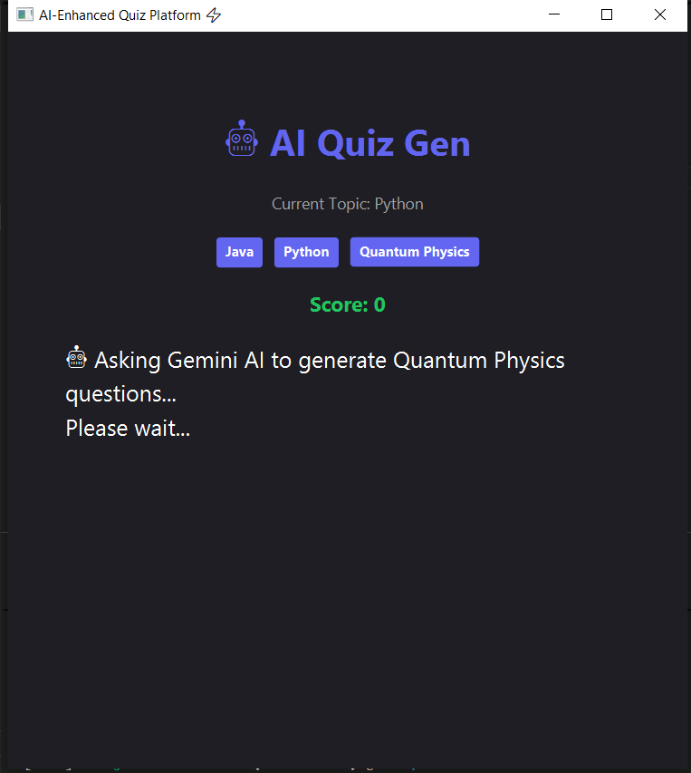
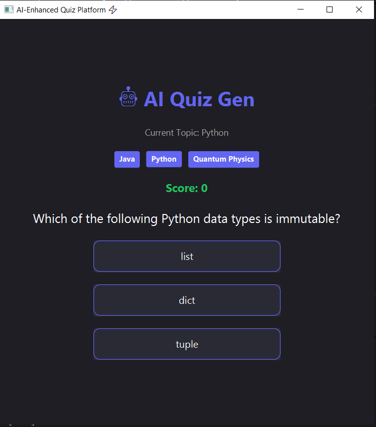

# 🧠 AI-Enhanced Quiz Platform

A JavaFX Desktop Application that uses the **Google Gemini API** to generate dynamic quiz questions on topics like Java, Python, and Science.

## 🚀 Features
* **Real AI Integration:** Connects to Google Gemini (Rest API).
* **Multi-Threading:** Fetches data in the background without freezing the UI.
* **Robust Error Handling:** Switches to offline backup questions if the API fails.

## 🛠️ How to Run
1. **Clone the repository** to your local machine.
2. **Get an API Key:**
   - Go to [Google AI Studio](https://aistudio.google.com/).
   - Create a free API Key.
3. **Configure the App:**
   - Open `src/com/quiz/AIService.java`.
   - Find the line `private static final String API_KEY`.
   - Paste your key inside the quotes.
4. **Run:**
   - Use Maven: `mvn javafx:run`

## 📸 Project Demo

